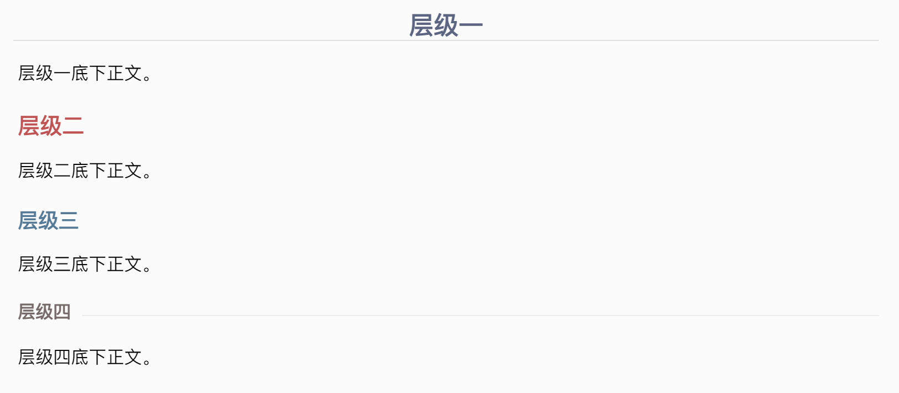
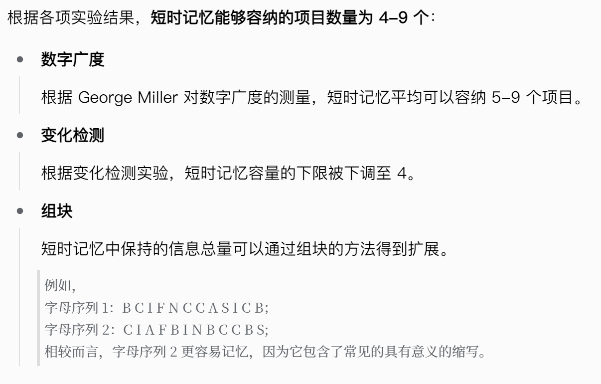

# README

# Oir 思源自用主题

## 介绍

本主题源自对思源自带主题 daylight/midnight 的魔改。对我来说，思源主要用于学习笔记，因为有跨学科的需求所以比较看重文字的排版和显示效果。思源自带的主题在功能上符合我的需求，所以我只在原基础上浅改了一下。

## 版本

### v1.1.0
改名 Oir 系列；
修改了字体、标题样式、正文标记格式、搜索窗口左右排列等；
配合新的编辑样式规范了码字模板。（见后文）

### v1.0.0

在自带主题的基础上修改了字体、标题样式、表格、大纲等。

# 码字模板

一些学习笔记的模板规范，完全基于自己的码字习惯，只作为参考。

## 标题层级

最多只用四层标题；因此 **h5 和 h6 都没有特别指定样式**，如果有需求可以自行更改。



## 正文内容

### 标记

对内容的标记涉及到标亮、加粗、下划线和斜体（<u>对内容的强调程度由强至弱</u>）：

* ==标亮==

  用于术语，强调等级 1

  > 例：==感受器 (sensory recptor)== 在感觉系统中直接接收刺激并将其转化为神经信号，通常是感觉器官中的感觉细胞。
  >
* **粗体**

  用于需要强调的一般内容，强调等级 2

  > 例：Jacoby 的“一夜成名”实验表明，**熟悉性可能会引发记忆错误**。
  >
* <u>下划线</u>

  用于需要强调的一般内容，强调等级 3

  > 例：情景记忆是对于个体参与过的特定<u>事件</u>的记忆；语义记忆则是对于一般<u>事实</u>信息的记忆。
  >
* *斜体*

  （严格来说不算“强调”）用于英语作品名，强调等级 4

  > 例：《怪奇物语》(*Stranger Things*) 巨好看。
  >

### 列表

有的人可能习惯于每一个段落都用列表的形式呈现，我比较喜欢完整的正文，所以对列表的使用也会有所规范。主要注意以下几点：

1. **内容**

    列表一般用于比较离散的信息，比如不同的类别、程度、过程、脉络等，这些信息如果不以无序列表或有序列表的形式展开可能会影响直接阅读的流畅性。
2. **形式**

    列表前的正文内容应带有冒号“：”，代表列表内容是前文的展开；每段列表以概括性语言为首，视情况而定需不需用到标记，并在下拉的拓展部分完善内容。具体效果如图。

    
3. **特殊情况**

    如果行文内容紧凑而不离散，但是整体实在有碍美观、影响阅读，也可以用列表来整理。这种情况应视为特殊情况，能避免则避免，不然规范就没意义了。
4. **求生欲**

    喜欢全文用列表的可以无视这些规范，一切以自己的习惯为准。

### 引述框

引述框主要有两点作用：

* **引述**

  > “引述框是用来引述的！”——原教旨主义者
  >
* **其他功能**

  引述框除了引述以外你也可以依据自己的喜欢来实现其他功能。

  > 例如：我就喜欢用引述框来举例子；而且一般只用于举例子——哪有那么多话要引述……
  >

### 其他

其他的功能就按照自己的喜好随意使用即可，没什么特别的规范。

#### 代码块示例

```python
# 该实例输出 Hello World!
print('Hello World!')
```

#### 公式块示例

$$
P(A|B)=\frac{P(B|A)\cdot P(B)}{P(A)}
$$

#### 表格示例

|col1|col2|col3|col4|col5|
| ------| ------| ------| ------| ------|
||||||
||||||
||||||

（特意删除了表头格式，因为有时候会用到没有表头的简单表格）

#### 其他特殊文字格式

|~~删除线~~|^上标^|~下标~|#标签#|<kbd>键盘</kbd>|
| ---------| ---------| ---------| ------------| ---------|

字体的话就自己设置吧，我不太喜欢在这个规范模板的基础再增添其他样式了，所以就保持默认。
